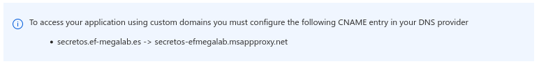
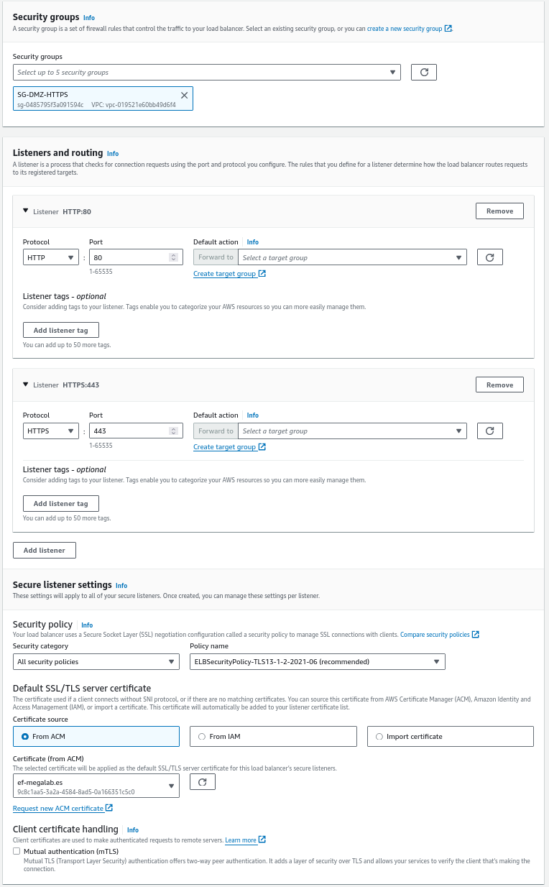
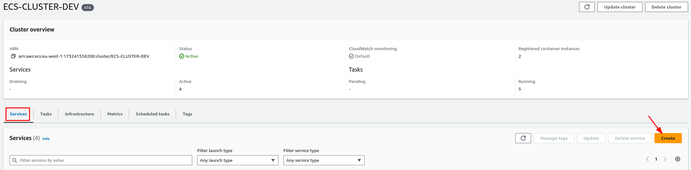
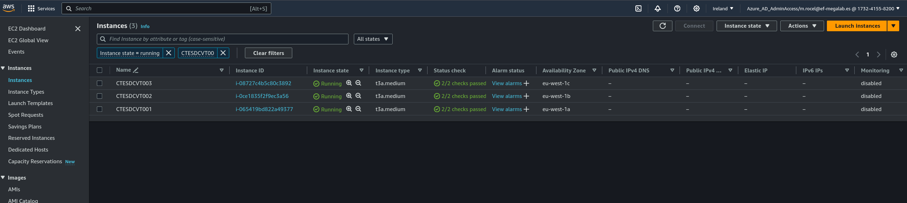

 ## YoPass Deployment
YoPass is a free and open source web application for fast and secure secret sharing. Its main goal is to minimize the amount of passwords circulating in ticket management systems, Slack messages and emails.

To deploy the YoPass application inside an EC2 we need to do the following:

 Launch EC2 instances 

1. Choose the Windows Server operating system

2. t3a.small instance type

3. Select CTES-LAN-A like subnet and choose the SG-DMZ-HTTPS security group

4. Join the instance to the domain directory.

5. Launch the instance

6. We repeat the same steps, but creating an instance with ubuntu. This instance does not have to belong to the AD domain and has to have the EC2SSM IAM Role to connect to Session Manager.

 Install Docker 

## You can use the following comands to install docker

1. log in like root user
`sudo su -`

2. download and install the availables packages
`apt update && apt upgrade -y`

3. Download the GPG docker from the website
`curl -fsSL https://download.docker.com/linux/ubuntu/gpg | gpg --dearmor -o /usr/share/keyrings/docker-archive-keyring.gpg`

4. Create the docker repository for the system
`echo "deb [arch=$(dpkg --print-architecture) signed-by=/usr/share/keyrings/docker-archive-keyring.gpg] https://download.docker.com/linux/ubuntu $(lsb_release -cs) stable" | tee /etc/apt/sources.list.d/docker.list > /dev/null`

5. Update the available packages after add the docker repository
`apt update`

6. Show more details about the versions
`apt-cache policy docker-ce`

7. Install docker
`apt install -y docker-ce`

8. Adds the ubuntu user to the docker group, allowing the user to run Docker commands without needing root privileges.
`usermod -aG docker ubuntu`

9. Show the actual state of the docker application
`systemctl status docker`

10. Enables the Docker service to start automatically at system boot.
`systemctl enable docker`

11. Set the permissions for the docker.sock file so that all users have read, write, and execute access. This may be necessary to allow certain applications or users to access Docker.
`chmod 777 /var/run/docker.sock`

12. Start the docker service
`systemctl start docker`

 Create YoPass container 

1. Clone the following repository with `git clone https://git.ef-megalab.es/dev-test/yopass-deployment.git`

2. Enter the deployment folder with `cd yopass-deployment/deploy/yopass-priv/`

3. Create the database container with `docker run --name memcached_yopass -d memcached`

4. Create the modified application image with  `docker build -t yopass-mod .`

5. Enter the following command to deploy the application `docker run -p 80:1337 --link memcached_yopass:memcached -d -e REACT_APP_DECRYPTION_URL=<URL> -e DB_IP=memcached:11211 yopass-mod`
> Remember to change the environment variable of the URL according to the version of the application you are using with its respective url address. For the public one you use REACT_APP_ENCRYPTION_URL and for the private one you use REACT_APP_DECRYPTION_URL; in case the instance itself is also in charge of decrypting the secrets then set the variable to the final url of the app.

6. Finally, run `docker container ls` and verify that the following containers are active

 Create azure proxy 

1. We use the following guide to create the azure proxy in the windows instance. Remember that because they are in a LAN subnet we can only connect through a workspace that is within the same VPC, also, to facilitate the connection use the remote desktop client provided by AWS.

LINK: https://git.ef-megalab.es/dev-test/application-proxy

Note: The internal url of the application will be the DNS name of the private IP of the instance.

## Other changes

### Change domain
In case you have any other domain registered in Azure that you want to use, you need to do the following.

1. In azure portal go to your AD>Enterprise Applications>Your App> Application Proxy and change the domain you want your app to use. Note: In some cases it is necessary to upload an SSL certificate, for this you can upload one manually when registering your application or you can configure one inside a load balancer.

2. The following message will appear asking you to add the following record in your DNS provider, in our case which is Route 53 we will do the following.

3. We will go to our hosted zones and create the registry with the values shown in the message.

### Add a specific connector group
In some cases some of the connectors you have registered will not have access to your application, so it may cause errors if left in the default connectors group, so to solve this you can do the next.

1. Create the new connector group and add the machine that contains the connector that can access your application site using the steps indicated in the same link that shows you how to install the azure proxy (the steps are almost at the end).

2. In the azure portal go to your AD>Enterprise Applications>Your Application> Application Proxy and select the connector group you just created.

Note: This step can also be used for those cases where you need an application to have the highest possible availability. So you can create groups of connectors that are only in charge of managing the traffic directed to that application.

 

To deploy in ECS we follow the steps:

 Prepare images 

1. Clone the repository with the yopass project modified with `git clone https://git.ef-megalab.es/dev-test/yopass-deployment.git`.

3. We position ourselves in the root folder of the project and build the image with `docker build -t yopass-encryption .`.

3. Log into the ECR service and create a new private repository.

4. Enter the repository and click on the 'View push commands' button.

5. We execute the commands 1, 3 and 4, but we modify the marked parts.

    - We change this first part of step 3 to the name of the image we created before: `yopass-decryption`.
    - This second part of step 3 we change it to the name of the image we want to display in the repository: `yopass-mod-url`.
    - This last part we change it to the name we assigned in the previous step: `yopass-mod-url`.

6. With this we will have the image uploaded, now we just save the uri.

 Prepare load balancer and target groups 

1. Go to the EC2 > Target Groups section and create 2 new groups with the following values.

    - The only thing that changes for each group is the name:
    `TG-YOPASS-PRIVATE` and `TG-YOPASS-PUBLIC`.

2. We do not add any element and click directly on create target group.

3. Go to the EC2 > Target Group section and create an application load balancer for the private instances.
    - In the section of target group we select the TG-YoPass-Priv

4. Access the load balancer created

5. Select the listener on port 80 and click on edit rules.

6. Here we will create the following:

7. First select the default rule and click on edit.

8. Here we make the indicated changes, leaving the response message that we want to return in case the requests to the load balancer do not match any of the future rules.

9. Save changes

10. Create a rule called Limit actions in public instances.

11. Add the following conditions

12. We define the action that will be taken in case any request matches the conditions, in this case we send a response of action not allowed to avoid that the users create secrets in the public instance and only allow it in the private one.

13. We assign a priority of 1 and click on create.

14. We repeat the same process of creating a rule with the name Redirect to private instance.

15. Add the following conditions and define the following action to redirect requests from ALB-YoPass-211657608.eu-west-1.elb.amazonaws.com to the Target Group with the private instances.

16. Assign a priority order of 2 and click on the create button.

17. We create a last rule with the name Redirect to public instance.

18. Add the conditions and actions indicated in the image to redirect the requests from lector-secretos.ef-megalab.es to the Target Group with the public instances.

19. Assign a priority order of 3 and click on the create button.

20. Repeat the same process for the listener on port 433.

 Define Tasks and deploy services 

1. Go to the ECS > Task definition section and create a new Task definition.

2. First we will create the task definition of the memcached service, for this we set only the following values y create.

4. Go to the ECS > Clusters section and create a new cluster.

5. We enter the cluster we created and create a new task.

6. We create the task with the following characteristics.

**Change the first field to the URL of the public instance and the second to the IP of the database.**

7. We wait for the task to be created completely and then we copy the private IP when entering the task configuration.

8. We go back to the part where we created the task definitions and create another one with the following settings.

    - Note: In the image URI part paste the value copied of the image that was uploaded to the repository before.

9. In the enviroment variables part we will set REACT_APP_ENCRYPTION_URL with the url of the private instance and DB_IP with the ip of the database we created before.

10. Create the task definition.

11. We return to the cluster we created before and create a new service with the following characteristics, this service will belong to the public instances of the application so we make sure to assign the name to identify it and choose the target group of the public instances.

12. Repeat the same process for the private instances, just change the name to SV-YoPass-Priv and make sure that the target group is that of the private instances and replaces the variable REACT_APP_ENCRYPTION_URL by REACT_APP_DECRYPTION_URL, assigning it the value of the url of the public instance,

 Create DNS record in private network 

Due to the way in which the proxy redirects the requests to the load balancer, it will be necessary to create a dns record within our private network that will allow us to properly resolve the certificate returned by the load balancer.

1. First we will locate the AD controllers.

2. Then we will connect to one of them.

3. We will enter the DNS configuration.

4. We will create a CNAME that will be an alias that responds to the load balancer address.

 Configure redirection and register application 

1. Finally we replicate the process explained to create the azure proxy from the home section.Finally we replicate the process explained to create the azure proxy from the startup section, but instead of using the DNS name of the private IP of the instance, we will use the CNAME that we registered earlier within the DNS of our private network.

2. It will also be necessary to create another record in Route 53 that redirects the requests from lector-secretos.ef-megalab.es to the load balancer.

    - Here we will use the DNS name that the load balancer has.

    

